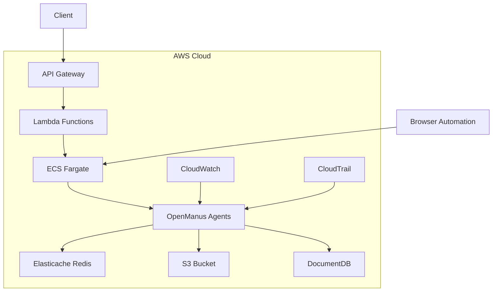
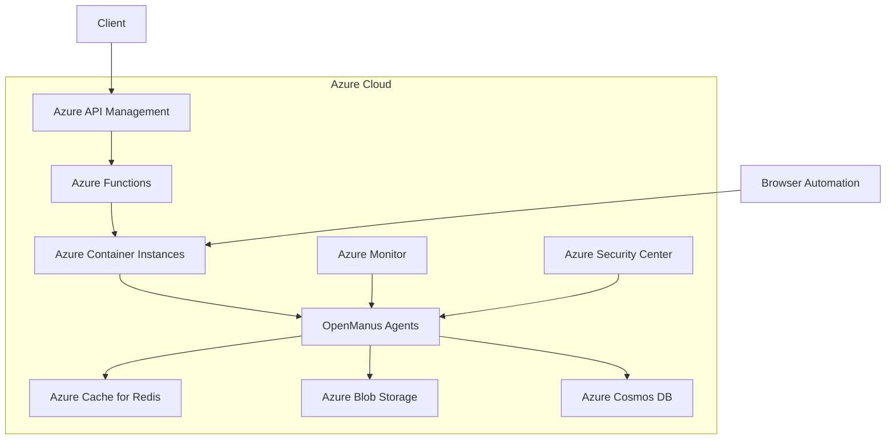
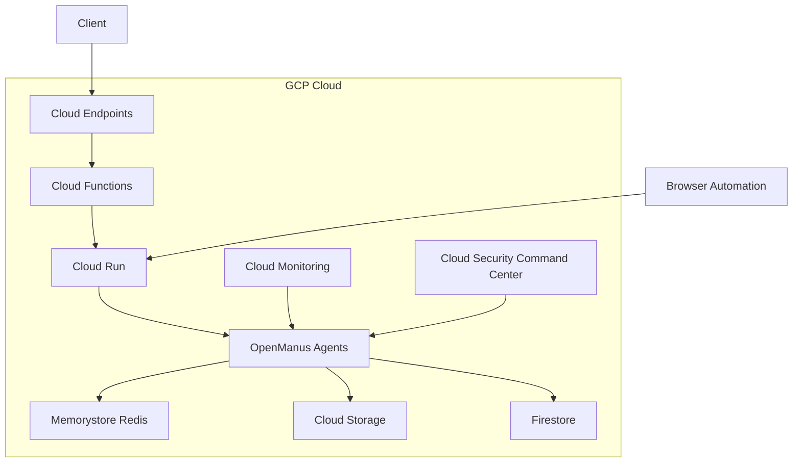

# Cloud Scaling Proposals for OpenManus

## AWS Implementation

### Architecture Overview



### Infrastructure Components

1. **Compute**
   - ECS Fargate for agent containers
   - Lambda for API endpoints
   - Auto-scaling based on CPU/Memory usage

2. **Storage**
   - S3 for file storage and tool outputs
   - DocumentDB for state management
   - Elasticache Redis for caching

3. **Networking**
   - VPC with private/public subnets
   - ALB for load balancing
   - Security groups for access control

4. **Monitoring**
   - CloudWatch for metrics and logging
   - CloudTrail for audit trails
   - X-Ray for tracing

### Infrastructure as Code (AWS CDK)

```typescript
import * as cdk from 'aws-cdk-lib';
import * as ecs from 'aws-cdk-lib/aws-ecs';
import * as ec2 from 'aws-cdk-lib/aws-ec2';
import * as s3 from 'aws-cdk-lib/aws-s3';
import * as docdb from 'aws-cdk-lib/aws-docdb';
import * as elasticache from 'aws-cdk-lib/aws-elasticache';

export class OpenManusStack extends cdk.Stack {
  constructor(scope: cdk.App, id: string, props?: cdk.StackProps) {
    super(scope, id, props);

    // VPC
    const vpc = new ec2.Vpc(this, 'OpenManusVPC', {
      maxAzs: 2,
      natGateways: 1,
    });

    // ECS Cluster
    const cluster = new ecs.Cluster(this, 'OpenManusCluster', {
      vpc,
    });

    // Fargate Service
    const fargateService = new ecs.FargateService(this, 'OpenManusService', {
      cluster,
      taskDefinition: new ecs.FargateTaskDefinition(this, 'TaskDef', {
        memoryLimitMiB: 2048,
        cpu: 1024,
      }),
      desiredCount: 2,
    });

    // DocumentDB
    const docdbCluster = new docdb.DatabaseCluster(this, 'OpenManusDB', {
      masterUser: {
        username: 'admin',
      },
      instanceType: ec2.InstanceType.of(ec2.InstanceClass.T3, ec2.InstanceSize.MEDIUM),
      vpc,
    });

    // Elasticache Redis
    const redis = new elasticache.CfnCacheCluster(this, 'OpenManusCache', {
      cacheNodeType: 'cache.t3.micro',
      engine: 'redis',
      numCacheNodes: 1,
      vpcSecurityGroupIds: [vpc.vpcDefaultSecurityGroup],
    });

    // S3 Bucket
    const bucket = new s3.Bucket(this, 'OpenManusStorage', {
      versioned: true,
      encryption: s3.BucketEncryption.S3_MANAGED,
    });
  }
}
```

## Azure Implementation

### Architecture Overview



### Infrastructure Components

1. **Compute**
   - Azure Container Instances for agent containers
   - Azure Functions for API endpoints
   - Auto-scaling based on metrics

2. **Storage**
   - Azure Blob Storage for file storage
   - Cosmos DB for state management
   - Azure Cache for Redis

3. **Networking**
   - Virtual Network with subnets
   - Application Gateway for load balancing
   - Network Security Groups

4. **Monitoring**
   - Azure Monitor for metrics
   - Application Insights for tracing
   - Security Center for security

### Infrastructure as Code (Terraform)

```hcl
provider "azurerm" {
  features {}
}

resource "azurerm_resource_group" "openmanus" {
  name     = "openmanus-rg"
  location = "eastus"
}

resource "azurerm_virtual_network" "vnet" {
  name                = "openmanus-vnet"
  address_space       = ["10.0.0.0/16"]
  location            = azurerm_resource_group.openmanus.location
  resource_group_name = azurerm_resource_group.openmanus.name
}

resource "azurerm_container_group" "agents" {
  name                = "openmanus-agents"
  location            = azurerm_resource_group.openmanus.location
  resource_group_name = azurerm_resource_group.openmanus.name
  ip_address_type     = "Public"
  os_type            = "Linux"

  container {
    name   = "openmanus-agent"
    image  = "openmanus/agent:latest"
    cpu    = "1"
    memory = "2"

    ports {
      port     = 80
      protocol = "TCP"
    }
  }
}

resource "azurerm_cosmosdb_account" "db" {
  name                = "openmanus-cosmos"
  location            = azurerm_resource_group.openmanus.location
  resource_group_name = azurerm_resource_group.openmanus.name
  offer_type         = "Standard"
  kind               = "MongoDB"

  consistency_policy {
    consistency_level = "Session"
  }

  geo_location {
    location          = azurerm_resource_group.openmanus.location
    failover_priority = 0
  }
}

resource "azurerm_redis_cache" "cache" {
  name                = "openmanus-cache"
  location            = azurerm_resource_group.openmanus.location
  resource_group_name = azurerm_resource_group.openmanus.name
  capacity            = 2
  family              = "C"
  sku_name            = "Standard"
  enable_non_ssl_port = false
  minimum_tls_version = "1.2"
}
```

## GCP Implementation

### Architecture Overview



### Infrastructure Components

1. **Compute**
   - Cloud Run for agent containers
   - Cloud Functions for API endpoints
   - Auto-scaling based on requests

2. **Storage**
   - Cloud Storage for file storage
   - Firestore for state management
   - Memorystore for Redis

3. **Networking**
   - VPC Network with subnets
   - Cloud Load Balancing
   - Cloud Armor for security

4. **Monitoring**
   - Cloud Monitoring
   - Cloud Trace
   - Security Command Center

### Infrastructure as Code (Terraform)

```hcl
provider "google" {
  project = "your-project-id"
  region  = "us-central1"
}

resource "google_project" "openmanus" {
  name       = "openmanus"
  project_id = "openmanus-${random_id.project.hex}"
}

resource "google_compute_network" "vpc" {
  name                    = "openmanus-vpc"
  auto_create_subnetworks = false
}

resource "google_cloud_run_service" "agents" {
  name     = "openmanus-agents"
  location = "us-central1"

  template {
    spec {
      containers {
        image = "gcr.io/your-project-id/openmanus-agent:latest"
        resources {
          limits = {
            cpu    = "1000m"
            memory = "2Gi"
          }
        }
      }
    }
  }

  traffic {
    percent         = 100
    latest_revision = true
  }
}

resource "google_firestore_database" "database" {
  name     = "(default)"
  location = "us-central"
  type     = "FIRESTORE_NATIVE"
}

resource "google_redis_instance" "cache" {
  name           = "openmanus-cache"
  memory_size_gb = 1
  region         = "us-central1"
  tier           = "BASIC"
}

resource "google_storage_bucket" "storage" {
  name          = "openmanus-storage"
  location      = "US"
  force_destroy = true
}
```

## Comparison of Cloud Providers

| Feature | AWS | Azure | GCP |
|---------|-----|-------|-----|
| Container Service | ECS Fargate | Container Instances | Cloud Run |
| Serverless Functions | Lambda | Azure Functions | Cloud Functions |
| NoSQL Database | DocumentDB | Cosmos DB | Firestore |
| Caching | Elasticache | Azure Cache for Redis | Memorystore |
| Object Storage | S3 | Blob Storage | Cloud Storage |
| Load Balancing | ALB | Application Gateway | Cloud Load Balancing |
| Monitoring | CloudWatch | Azure Monitor | Cloud Monitoring |
| Security | CloudTrail | Security Center | Security Command Center |
| Infrastructure as Code | CDK | Terraform | Terraform |

## Recommendations

1. **For AWS Users**
   - Use ECS Fargate for container management
   - Leverage DocumentDB for state management
   - Implement CDK for infrastructure management

2. **For Azure Users**
   - Use Container Instances for agent deployment
   - Implement Cosmos DB for state management
   - Use Terraform for infrastructure management

3. **For GCP Users**
   - Use Cloud Run for container deployment
   - Implement Firestore for state management
   - Use Terraform for infrastructure management

## Cost Considerations

1. **AWS**
   - ECS Fargate: ~$0.04 per vCPU per hour
   - DocumentDB: ~$0.10 per GB per month
   - S3: ~$0.023 per GB per month

2. **Azure**
   - Container Instances: ~$0.05 per vCPU per hour
   - Cosmos DB: ~$0.25 per GB per month
   - Blob Storage: ~$0.02 per GB per month

3. **GCP**
   - Cloud Run: ~$0.000024 per vCPU per second
   - Firestore: ~$0.18 per GB per month
   - Cloud Storage: ~$0.02 per GB per month

## Implementation Timeline

1. **Phase 1: Setup (2 weeks)**
   - Infrastructure setup
   - CI/CD pipeline
   - Monitoring configuration

2. **Phase 2: Migration (2 weeks)**
   - Agent containerization
   - Data migration
   - Testing and validation

3. **Phase 3: Optimization (1 week)**
   - Performance tuning
   - Cost optimization
   - Security hardening

## Next Steps

1. Choose preferred cloud provider
2. Set up development environment
3. Implement infrastructure as code
4. Deploy initial test environment
5. Migrate existing agents
6. Monitor and optimize
