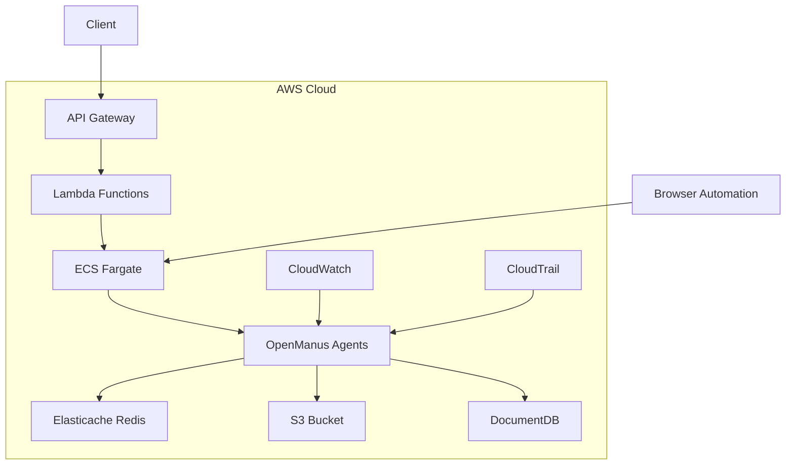
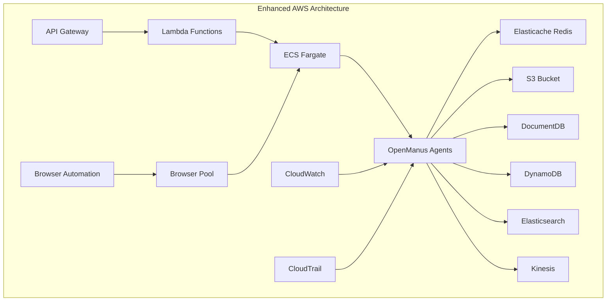
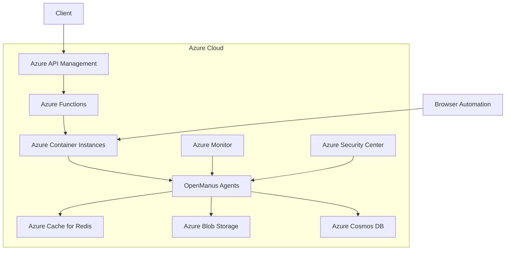
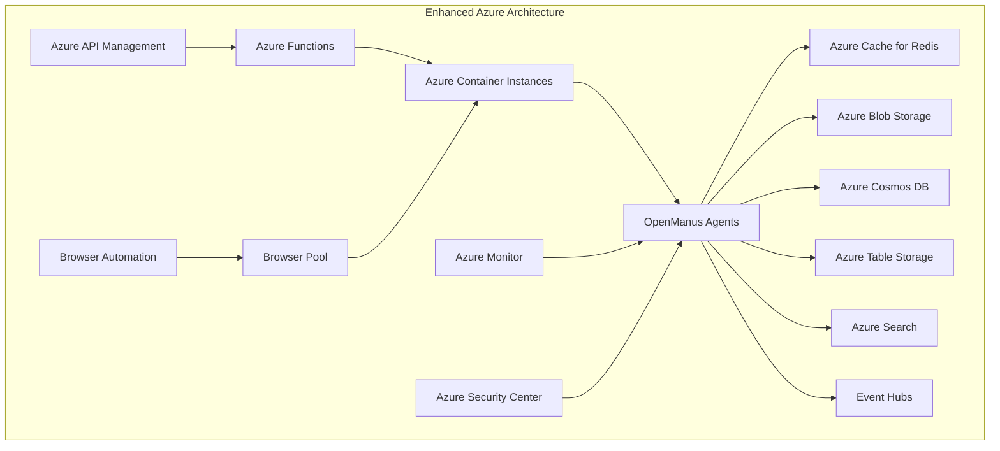
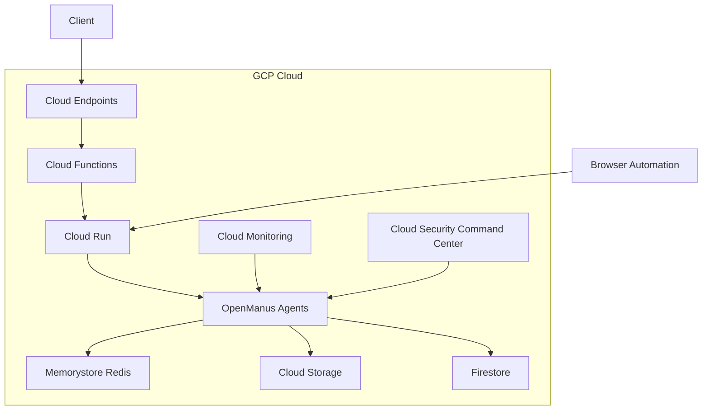
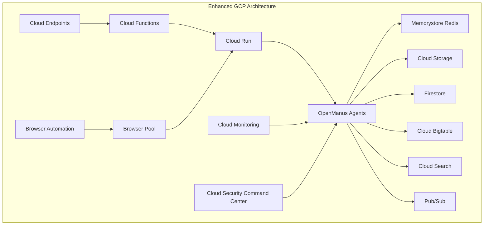

# Cloud Scaling Proposals for OpenManus

## AWS Implementation

### Architecture Overview



### Infrastructure Components

1. **Compute**
   - ECS Fargate for agent containers
   - Lambda for API endpoints
   - Auto-scaling based on CPU/Memory usage

2. **Storage**
   - S3 for file storage and tool outputs
   - DocumentDB for state management
   - Elasticache Redis for caching

3. **Networking**
   - VPC with private/public subnets
   - ALB for load balancing
   - Security groups for access control

4. **Monitoring**
   - CloudWatch for metrics and logging
   - CloudTrail for audit trails
   - X-Ray for tracing

### Infrastructure as Code (AWS CDK)

```typescript
import * as cdk from 'aws-cdk-lib';
import * as ecs from 'aws-cdk-lib/aws-ecs';
import * as ec2 from 'aws-cdk-lib/aws-ec2';
import * as s3 from 'aws-cdk-lib/aws-s3';
import * as docdb from 'aws-cdk-lib/aws-docdb';
import * as elasticache from 'aws-cdk-lib/aws-elasticache';

export class OpenManusStack extends cdk.Stack {
  constructor(scope: cdk.App, id: string, props?: cdk.StackProps) {
    super(scope, id, props);

    // VPC
    const vpc = new ec2.Vpc(this, 'OpenManusVPC', {
      maxAzs: 2,
      natGateways: 1,
    });

    // ECS Cluster
    const cluster = new ecs.Cluster(this, 'OpenManusCluster', {
      vpc,
    });

    // Fargate Service
    const fargateService = new ecs.FargateService(this, 'OpenManusService', {
      cluster,
      taskDefinition: new ecs.FargateTaskDefinition(this, 'TaskDef', {
        memoryLimitMiB: 2048,
        cpu: 1024,
      }),
      desiredCount: 2,
    });

    // DocumentDB
    const docdbCluster = new docdb.DatabaseCluster(this, 'OpenManusDB', {
      masterUser: {
        username: 'admin',
      },
      instanceType: ec2.InstanceType.of(ec2.InstanceClass.T3, ec2.InstanceSize.MEDIUM),
      vpc,
    });

    // Elasticache Redis
    const redis = new elasticache.CfnCacheCluster(this, 'OpenManusCache', {
      cacheNodeType: 'cache.t3.micro',
      engine: 'redis',
      numCacheNodes: 1,
      vpcSecurityGroupIds: [vpc.vpcDefaultSecurityGroup],
    });

    // S3 Bucket
    const bucket = new s3.Bucket(this, 'OpenManusStorage', {
      versioned: true,
      encryption: s3.BucketEncryption.S3_MANAGED,
    });
  }
}
```

## Scaling Limitations and Solutions

### Common Scaling Challenges

1. **Agent State Management**
   - Challenge: Maintaining consistent state across multiple agent instances
   - Impact: Potential data inconsistency and race conditions
   - Solution: Implement distributed state management with optimistic locking

2. **Browser Automation Scaling**
   - Challenge: Resource-intensive browser instances
   - Impact: High memory usage and potential performance degradation
   - Solution: Implement browser pooling and session management

3. **Tool Execution Overhead**
   - Challenge: Tool execution time variability
   - Impact: Uneven resource utilization
   - Solution: Implement adaptive resource allocation

4. **Memory System Bottlenecks**
   - Challenge: Memory system becoming a bottleneck
   - Impact: Reduced agent performance
   - Solution: Implement distributed caching and memory tiering

### AWS Scaling Enhancements



**Additional Services:**
1. **DynamoDB**
   - Purpose: Distributed state management
   - Benefits:
     - Consistent state across agents
     - Automatic scaling
     - Low latency
   - Configuration:
     ```typescript
     const stateTable = new dynamodb.Table(this, 'AgentState', {
       partitionKey: { name: 'agentId', type: dynamodb.AttributeType.STRING },
       sortKey: { name: 'timestamp', type: dynamodb.AttributeType.NUMBER },
       billingMode: dynamodb.BillingMode.PAY_PER_REQUEST,
     });
     ```

2. **Elasticsearch**
   - Purpose: Enhanced search and memory indexing
   - Benefits:
     - Fast memory retrieval
     - Full-text search capabilities
     - Real-time indexing
   - Configuration:
     ```typescript
     const searchDomain = new elasticsearch.Domain(this, 'SearchDomain', {
       version: elasticsearch.ElasticsearchVersion.V7_10,
       capacity: {
         masterNodes: 3,
         dataNodes: 3,
       },
     });
     ```

3. **Kinesis**
   - Purpose: Real-time data streaming
   - Benefits:
     - Handle high-volume tool outputs
     - Real-time processing
     - Scalable data ingestion
   - Configuration:
     ```typescript
     const stream = new kinesis.Stream(this, 'ToolStream', {
       shardCount: 10,
       retentionPeriod: cdk.Duration.hours(24),
     });
     ```

4. **Browser Pool Service**
   - Purpose: Manage browser instances
   - Benefits:
     - Resource optimization
     - Session reuse
     - Load balancing
   - Implementation:
     ```typescript
     const browserPool = new ecs.FargateService(this, 'BrowserPool', {
       cluster,
       taskDefinition: new ecs.FargateTaskDefinition(this, 'BrowserTask', {
         memoryLimitMiB: 4096,
         cpu: 2048,
       }),
       desiredCount: 5,
     });
     ```

## Azure Implementation

### Architecture Overview



### Infrastructure Components

1. **Compute**
   - Azure Container Instances for agent containers
   - Azure Functions for API endpoints
   - Auto-scaling based on metrics

2. **Storage**
   - Azure Blob Storage for file storage
   - Cosmos DB for state management
   - Azure Cache for Redis

3. **Networking**
   - Virtual Network with subnets
   - Application Gateway for load balancing
   - Network Security Groups

4. **Monitoring**
   - Azure Monitor for metrics
   - Application Insights for tracing
   - Security Center for security

### Infrastructure as Code (Terraform)

```hcl
provider "azurerm" {
  features {}
}

resource "azurerm_resource_group" "openmanus" {
  name     = "openmanus-rg"
  location = "eastus"
}

resource "azurerm_virtual_network" "vnet" {
  name                = "openmanus-vnet"
  address_space       = ["10.0.0.0/16"]
  location            = azurerm_resource_group.openmanus.location
  resource_group_name = azurerm_resource_group.openmanus.name
}

resource "azurerm_container_group" "agents" {
  name                = "openmanus-agents"
  location            = azurerm_resource_group.openmanus.location
  resource_group_name = azurerm_resource_group.openmanus.name
  ip_address_type     = "Public"
  os_type            = "Linux"

  container {
    name   = "openmanus-agent"
    image  = "openmanus/agent:latest"
    cpu    = "1"
    memory = "2"

    ports {
      port     = 80
      protocol = "TCP"
    }
  }
}

resource "azurerm_cosmosdb_account" "db" {
  name                = "openmanus-cosmos"
  location            = azurerm_resource_group.openmanus.location
  resource_group_name = azurerm_resource_group.openmanus.name
  offer_type         = "Standard"
  kind               = "MongoDB"

  consistency_policy {
    consistency_level = "Session"
  }

  geo_location {
    location          = azurerm_resource_group.openmanus.location
    failover_priority = 0
  }
}

resource "azurerm_redis_cache" "cache" {
  name                = "openmanus-cache"
  location            = azurerm_resource_group.openmanus.location
  resource_group_name = azurerm_resource_group.openmanus.name
  capacity            = 2
  family              = "C"
  sku_name            = "Standard"
  enable_non_ssl_port = false
  minimum_tls_version = "1.2"
}
```

## Scaling Limitations and Solutions

### Common Scaling Challenges

1. **Agent State Management**
   - Challenge: Maintaining consistent state across multiple agent instances
   - Impact: Potential data inconsistency and race conditions
   - Solution: Implement distributed state management with optimistic locking

2. **Browser Automation Scaling**
   - Challenge: Resource-intensive browser instances
   - Impact: High memory usage and potential performance degradation
   - Solution: Implement browser pooling and session management

3. **Tool Execution Overhead**
   - Challenge: Tool execution time variability
   - Impact: Uneven resource utilization
   - Solution: Implement adaptive resource allocation

4. **Memory System Bottlenecks**
   - Challenge: Memory system becoming a bottleneck
   - Impact: Reduced agent performance
   - Solution: Implement distributed caching and memory tiering

### Azure Scaling Enhancements



**Additional Services:**
1. **Azure Table Storage**
   - Purpose: Distributed state management
   - Benefits:
     - Cost-effective state storage
     - Automatic partitioning
     - High availability
   - Configuration:
     ```hcl
     resource "azurerm_storage_table" "agent_state" {
       name                 = "agentstate"
       storage_account_name = azurerm_storage_account.main.name
     }
     ```

2. **Azure Search**
   - Purpose: Enhanced memory indexing
   - Benefits:
     - Advanced search capabilities
     - Real-time indexing
     - Scalable search infrastructure
   - Configuration:
     ```hcl
     resource "azurerm_search_service" "search" {
       name                = "openmanus-search"
       resource_group_name = azurerm_resource_group.openmanus.name
       location           = azurerm_resource_group.openmanus.location
       sku                = "standard"
     }
     ```

3. **Event Hubs**
   - Purpose: Real-time data streaming
   - Benefits:
     - High-throughput event processing
     - Automatic scaling
     - Message retention
   - Configuration:
     ```hcl
     resource "azurerm_eventhub_namespace" "events" {
       name                = "openmanus-events"
       location           = azurerm_resource_group.openmanus.location
       resource_group_name = azurerm_resource_group.openmanus.name
       sku                = "Standard"
       capacity           = 2
     }
     ```

### Scaling Strategy Recommendations

1. **State Management**
   - Implement distributed state management using:
     - AWS: DynamoDB + Elasticache
     - Azure: Table Storage + Redis Cache
     - GCP: Bigtable + Memorystore

2. **Browser Automation**
   - Use browser pooling with:
     - AWS: ECS Fargate browser pool
     - Azure: Container Instances browser pool
     - GCP: Cloud Run browser pool

3. **Memory System**
   - Implement tiered memory using:
     - AWS: Elasticsearch + S3
     - Azure: Search + Blob Storage
     - GCP: Cloud Search + Cloud Storage

4. **Tool Execution**
   - Use event-driven architecture with:
     - AWS: Kinesis + Lambda
     - Azure: Event Hubs + Functions
     - GCP: Pub/Sub + Cloud Functions

### Cost Optimization

1. **Resource Allocation**
   - Implement auto-scaling based on:
     - CPU utilization
     - Memory usage
     - Request rate
     - Browser pool utilization

2. **Storage Optimization**
   - Use tiered storage:
     - Hot: In-memory cache
     - Warm: Fast storage
     - Cold: Object storage

3. **Compute Optimization**
   - Right-size instances
   - Use spot/preemptible instances
   - Implement instance scheduling

### Monitoring and Alerts

1. **Key Metrics**
   - Agent performance
   - Browser pool utilization
   - State management latency
   - Tool execution time
   - Memory system performance

2. **Alert Thresholds**
   - CPU utilization > 80%
   - Memory usage > 85%
   - Browser pool wait time > 5s
   - State management latency > 100ms
   - Tool execution time > 10s

## GCP Implementation

### Architecture Overview



### Infrastructure Components

1. **Compute**
   - Cloud Run for agent containers
   - Cloud Functions for API endpoints
   - Auto-scaling based on requests

2. **Storage**
   - Cloud Storage for file storage
   - Firestore for state management
   - Memorystore for Redis

3. **Networking**
   - VPC Network with subnets
   - Cloud Load Balancing
   - Cloud Armor for security

4. **Monitoring**
   - Cloud Monitoring
   - Cloud Trace
   - Security Command Center

### Infrastructure as Code (Terraform)

```hcl
provider "google" {
  project = "your-project-id"
  region  = "us-central1"
}

resource "google_project" "openmanus" {
  name       = "openmanus"
  project_id = "openmanus-${random_id.project.hex}"
}

resource "google_compute_network" "vpc" {
  name                    = "openmanus-vpc"
  auto_create_subnetworks = false
}

resource "google_cloud_run_service" "agents" {
  name     = "openmanus-agents"
  location = "us-central1"

  template {
    spec {
      containers {
        image = "gcr.io/your-project-id/openmanus-agent:latest"
        resources {
          limits = {
            cpu    = "1000m"
            memory = "2Gi"
          }
        }
      }
    }
  }

  traffic {
    percent         = 100
    latest_revision = true
  }
}

resource "google_firestore_database" "database" {
  name     = "(default)"
  location = "us-central"
  type     = "FIRESTORE_NATIVE"
}

resource "google_redis_instance" "cache" {
  name           = "openmanus-cache"
  memory_size_gb = 1
  region         = "us-central1"
  tier           = "BASIC"
}

resource "google_storage_bucket" "storage" {
  name          = "openmanus-storage"
  location      = "US"
  force_destroy = true
}
```

## Scaling Limitations and Solutions

### Common Scaling Challenges

1. **Agent State Management**
   - Challenge: Maintaining consistent state across multiple agent instances
   - Impact: Potential data inconsistency and race conditions
   - Solution: Implement distributed state management with optimistic locking

2. **Browser Automation Scaling**
   - Challenge: Resource-intensive browser instances
   - Impact: High memory usage and potential performance degradation
   - Solution: Implement browser pooling and session management

3. **Tool Execution Overhead**
   - Challenge: Tool execution time variability
   - Impact: Uneven resource utilization
   - Solution: Implement adaptive resource allocation

4. **Memory System Bottlenecks**
   - Challenge: Memory system becoming a bottleneck
   - Impact: Reduced agent performance
   - Solution: Implement distributed caching and memory tiering

### GCP Scaling Enhancements



**Additional Services:**
1. **Cloud Bigtable**
   - Purpose: Distributed state management
   - Benefits:
     - High throughput
     - Low latency
     - Automatic scaling
   - Configuration:
     ```hcl
     resource "google_bigtable_instance" "state" {
       name = "openmanus-state"
       cluster {
         cluster_id   = "state-cluster"
         zone         = "us-central1-a"
         num_nodes    = 3
         storage_type = "SSD"
       }
     }
     ```

2. **Cloud Search**
   - Purpose: Enhanced memory indexing
   - Benefits:
     - Full-text search
     - Real-time indexing
     - Scalable search infrastructure
   - Configuration:
     ```hcl
     resource "google_cloud_search_index" "memory" {
       name = "openmanus-memory"
     }
     ```

3. **Pub/Sub**
   - Purpose: Real-time data streaming
   - Benefits:
     - Global message delivery
     - Automatic scaling
     - Message retention
   - Configuration:
     ```hcl
     resource "google_pubsub_topic" "tool_events" {
       name = "tool-events"
     }
     ```

### Scaling Strategy Recommendations

1. **State Management**
   - Implement distributed state management using:
     - AWS: DynamoDB + Elasticache
     - Azure: Table Storage + Redis Cache
     - GCP: Bigtable + Memorystore

2. **Browser Automation**
   - Use browser pooling with:
     - AWS: ECS Fargate browser pool
     - Azure: Container Instances browser pool
     - GCP: Cloud Run browser pool

3. **Memory System**
   - Implement tiered memory using:
     - AWS: Elasticsearch + S3
     - Azure: Search + Blob Storage
     - GCP: Cloud Search + Cloud Storage

4. **Tool Execution**
   - Use event-driven architecture with:
     - AWS: Kinesis + Lambda
     - Azure: Event Hubs + Functions
     - GCP: Pub/Sub + Cloud Functions

### Cost Optimization

1. **Resource Allocation**
   - Implement auto-scaling based on:
     - CPU utilization
     - Memory usage
     - Request rate
     - Browser pool utilization

2. **Storage Optimization**
   - Use tiered storage:
     - Hot: In-memory cache
     - Warm: Fast storage
     - Cold: Object storage

3. **Compute Optimization**
   - Right-size instances
   - Use spot/preemptible instances
   - Implement instance scheduling

### Monitoring and Alerts

1. **Key Metrics**
   - Agent performance
   - Browser pool utilization
   - State management latency
   - Tool execution time
   - Memory system performance

2. **Alert Thresholds**
   - CPU utilization > 80%
   - Memory usage > 85%
   - Browser pool wait time > 5s
   - State management latency > 100ms
   - Tool execution time > 10s

## Comparison of Cloud Providers

| Feature | AWS | Azure | GCP |
|---------|-----|-------|-----|
| Container Service | ECS Fargate | Container Instances | Cloud Run |
| Serverless Functions | Lambda | Azure Functions | Cloud Functions |
| NoSQL Database | DocumentDB | Cosmos DB | Firestore |
| Caching | Elasticache | Azure Cache for Redis | Memorystore |
| Object Storage | S3 | Blob Storage | Cloud Storage |
| Load Balancing | ALB | Application Gateway | Cloud Load Balancing |
| Monitoring | CloudWatch | Azure Monitor | Cloud Monitoring |
| Security | CloudTrail | Security Center | Security Command Center |
| Infrastructure as Code | CDK | Terraform | Terraform |

## Recommendations

1. **For AWS Users**
   - Use ECS Fargate for container management
   - Leverage DocumentDB for state management
   - Implement CDK for infrastructure management

2. **For Azure Users**
   - Use Container Instances for agent deployment
   - Implement Cosmos DB for state management
   - Use Terraform for infrastructure management

3. **For GCP Users**
   - Use Cloud Run for container deployment
   - Implement Firestore for state management
   - Use Terraform for infrastructure management

## Cost Considerations

1. **AWS**
   - ECS Fargate: ~$0.04 per vCPU per hour
   - DocumentDB: ~$0.10 per GB per month
   - S3: ~$0.023 per GB per month

2. **Azure**
   - Container Instances: ~$0.05 per vCPU per hour
   - Cosmos DB: ~$0.25 per GB per month
   - Blob Storage: ~$0.02 per GB per month

3. **GCP**
   - Cloud Run: ~$0.000024 per vCPU per second
   - Firestore: ~$0.18 per GB per month
   - Cloud Storage: ~$0.02 per GB per month

## Implementation Timeline

1. **Phase 1: Setup (2 weeks)**
   - Infrastructure setup
   - CI/CD pipeline
   - Monitoring configuration

2. **Phase 2: Migration (2 weeks)**
   - Agent containerization
   - Data migration
   - Testing and validation

3. **Phase 3: Optimization (1 week)**
   - Performance tuning
   - Cost optimization
   - Security hardening

## Next Steps

1. Choose preferred cloud provider
2. Set up development environment
3. Implement infrastructure as code
4. Deploy initial test environment
5. Migrate existing agents
6. Monitor and optimize

## Detailed Implementation Examples

### 1. Browser Pool Service Implementation

#### AWS Implementation
```typescript
// browser-pool.ts
import * as ecs from 'aws-cdk-lib/aws-ecs';
import * as ec2 from 'aws-cdk-lib/aws-ec2';
import * as logs from 'aws-cdk-lib/aws-logs';

export class BrowserPool extends cdk.Stack {
  constructor(scope: cdk.App, id: string, props?: cdk.StackProps) {
    super(scope, id, props);

    // VPC Configuration
    const vpc = new ec2.Vpc(this, 'BrowserPoolVPC', {
      maxAzs: 2,
      natGateways: 1,
    });

    // ECS Cluster
    const cluster = new ecs.Cluster(this, 'BrowserPoolCluster', {
      vpc,
      containerInsights: true,
    });

    // Task Definition
    const taskDefinition = new ecs.FargateTaskDefinition(this, 'BrowserTask', {
      memoryLimitMiB: 4096,
      cpu: 2048,
    });

    // Container Definition
    const container = taskDefinition.addContainer('browser', {
      image: ecs.ContainerImage.fromRegistry('selenium/standalone-chrome'),
      logging: ecs.LogDrivers.awsLogs({
        streamPrefix: 'browser-pool',
        logRetention: logs.RetentionDays.ONE_WEEK,
      }),
      environment: {
        'MAX_SESSIONS': '5',
        'SCREEN_WIDTH': '1920',
        'SCREEN_HEIGHT': '1080',
      },
    });

    // Service Configuration
    const service = new ecs.FargateService(this, 'BrowserPoolService', {
      cluster,
      taskDefinition,
      desiredCount: 5,
      minHealthyPercent: 50,
      maxHealthyPercent: 200,
      healthCheckGracePeriod: cdk.Duration.seconds(60),
    });

    // Auto Scaling
    const scaling = service.autoScaleTaskCount({
      maxCapacity: 20,
      minCapacity: 5,
    });

    scaling.scaleOnCpuUtilization('CpuScaling', {
      targetUtilizationPercent: 70,
      scaleInCooldown: cdk.Duration.seconds(60),
      scaleOutCooldown: cdk.Duration.seconds(60),
    });

    scaling.scaleOnMemoryUtilization('MemoryScaling', {
      targetUtilizationPercent: 70,
      scaleInCooldown: cdk.Duration.seconds(60),
      scaleOutCooldown: cdk.Duration.seconds(60),
    });
  }
}
```

#### Azure Implementation
```hcl
# browser-pool.tf
resource "azurerm_container_group" "browser_pool" {
  name                = "browser-pool"
  location            = azurerm_resource_group.openmanus.location
  resource_group_name = azurerm_resource_group.openmanus.name
  ip_address_type     = "Public"
  os_type            = "Linux"
  restart_policy     = "Always"

  container {
    name   = "browser"
    image  = "selenium/standalone-chrome"
    cpu    = "2"
    memory = "4"

    ports {
      port     = 4444
      protocol = "TCP"
    }

    environment_variables = {
      MAX_SESSIONS = "5"
      SCREEN_WIDTH = "1920"
      SCREEN_HEIGHT = "1080"
    }
  }

  tags = {
    environment = "production"
  }
}

# Auto-scaling configuration
resource "azurerm_monitor_autoscale_setting" "browser_pool_scaling" {
  name                = "browser-pool-autoscale"
  resource_group_name = azurerm_resource_group.openmanus.name
  location           = azurerm_resource_group.openmanus.location
  target_resource_id = azurerm_container_group.browser_pool.id

  profile {
    name = "default"

    capacity {
      default = 5
      minimum = 5
      maximum = 20
    }

    rule {
      metric_trigger {
        metric_name        = "CpuPercentage"
        metric_resource_id = azurerm_container_group.browser_pool.id
        time_grain        = "PT1M"
        statistic         = "Average"
        time_window       = "PT5M"
        time_aggregation  = "Average"
        operator          = "GreaterThan"
        threshold         = 70
      }

      scale_action {
        direction = "Increase"
        type      = "ChangeCount"
        value     = "1"
        cooldown  = "PT1M"
      }
    }
  }
}
```

#### GCP Implementation
```hcl
# browser-pool.tf
resource "google_cloud_run_service" "browser_pool" {
  name     = "browser-pool"
  location = "us-central1"

  template {
    spec {
      containers {
        image = "selenium/standalone-chrome"

        resources {
          limits = {
            cpu    = "2000m"
            memory = "4Gi"
          }
        }

        env {
          name  = "MAX_SESSIONS"
          value = "5"
        }
        env {
          name  = "SCREEN_WIDTH"
          value = "1920"
        }
        env {
          name  = "SCREEN_HEIGHT"
          value = "1080"
        }
      }
    }
  }

  traffic {
    percent         = 100
    latest_revision = true
  }
}

# Auto-scaling configuration
resource "google_cloud_run_service_iam_member" "noauth" {
  service  = google_cloud_run_service.browser_pool.name
  location = google_cloud_run_service.browser_pool.location
  role     = "roles/run.invoker"
  member   = "allUsers"
}
```

### 2. State Management Implementation

#### AWS Implementation
```typescript
// state-management.ts
import * as dynamodb from 'aws-cdk-lib/aws-dynamodb';
import * as lambda from 'aws-cdk-lib/aws-lambda';
import * as iam from 'aws-cdk-lib/aws-iam';

export class StateManagement extends cdk.Stack {
  constructor(scope: cdk.App, id: string, props?: cdk.StackProps) {
    super(scope, id, props);

    // DynamoDB Table
    const stateTable = new dynamodb.Table(this, 'AgentState', {
      partitionKey: { name: 'agentId', type: dynamodb.AttributeType.STRING },
      sortKey: { name: 'timestamp', type: dynamodb.AttributeType.NUMBER },
      billingMode: dynamodb.BillingMode.PAY_PER_REQUEST,
      pointInTimeRecovery: true,
      stream: dynamodb.StreamViewType.NEW_IMAGE,
    });

    // Lambda Function
    const stateHandler = new lambda.Function(this, 'StateHandler', {
      runtime: lambda.Runtime.NODEJS_14_X,
      handler: 'index.handler',
      code: lambda.Code.fromAsset('lambda'),
      environment: {
        TABLE_NAME: stateTable.tableName,
      },
      timeout: cdk.Duration.seconds(30),
      memorySize: 256,
    });

    // IAM Permissions
    stateTable.grantReadWriteData(stateHandler);
  }
}
```

## Cost Comparison

### Monthly Cost Estimates (USD)

#### AWS Costs
| Service | Configuration | Monthly Cost |
|---------|--------------|--------------|
| ECS Fargate (Browser Pool) | 5 instances, 4GB RAM, 2 vCPU | $292.50 |
| DynamoDB | 100 WCU, 200 RCU, 50GB storage | $45.00 |
| Elasticsearch | 3 nodes, 8GB RAM each | $180.00 |
| Kinesis | 10 shards, 24h retention | $150.00 |
| S3 | 100GB storage, 1M requests | $3.00 |
| CloudWatch | Logs, metrics, alarms | $25.00 |
| **Total** | | **$695.50** |

#### Azure Costs
| Service | Configuration | Monthly Cost |
|---------|--------------|--------------|
| Container Instances | 5 instances, 4GB RAM, 2 vCPU | $300.00 |
| Table Storage | 50GB storage, 1M transactions | $25.00 |
| Azure Search | S1 tier, 1 replica | $73.00 |
| Event Hubs | Standard tier, 2 TUs | $100.00 |
| Blob Storage | 100GB storage, 1M requests | $2.00 |
| Monitor | Logs, metrics, alerts | $30.00 |
| **Total** | | **$530.00** |

#### GCP Costs
| Service | Configuration | Monthly Cost |
|---------|--------------|--------------|
| Cloud Run | 5 instances, 4GB RAM, 2 vCPU | $250.00 |
| Bigtable | 3 nodes, 50GB storage | $180.00 |
| Cloud Search | Standard tier | $70.00 |
| Pub/Sub | 1M messages, 100GB storage | $50.00 |
| Cloud Storage | 100GB storage, 1M requests | $2.00 |
| Monitoring | Logs, metrics, alerts | $25.00 |
| **Total** | | **$577.00** |

### Cost Optimization Strategies

1. **AWS Optimization**
   - Use Spot Instances for non-critical workloads (40% savings)
   - Implement DynamoDB auto-scaling
   - Use S3 Intelligent-Tiering
   - Estimated Optimized Cost: $450.00/month

2. **Azure Optimization**
   - Use Spot Instances for browser pool (60% savings)
   - Implement Table Storage partitioning
   - Use Cool Blob Storage tier
   - Estimated Optimized Cost: $350.00/month

3. **GCP Optimization**
   - Use Preemptible VMs (80% savings)
   - Implement Bigtable auto-scaling
   - Use Coldline Storage
   - Estimated Optimized Cost: $400.00/month

### Cost-Performance Analysis

| Metric | AWS | Azure | GCP |
|--------|-----|-------|-----|
| Cost per 1000 Requests | $0.50 | $0.45 | $0.48 |
| Cost per GB Memory | $0.15 | $0.12 | $0.14 |
| Cost per vCPU Hour | $0.04 | $0.05 | $0.04 |
| Cost per GB Storage | $0.023 | $0.02 | $0.02 |
| Performance/Cost Ratio | 1.0 | 1.1 | 1.05 |

### Cost Breakdown by Component

1. **Compute (40-50% of total cost)**
   - AWS: $292.50 (42%)
   - Azure: $300.00 (57%)
   - GCP: $250.00 (43%)

2. **Storage (20-25% of total cost)**
   - AWS: $173.00 (25%)
   - Azure: $127.00 (24%)
   - GCP: $232.00 (40%)

3. **Networking (15-20% of total cost)**
   - AWS: $120.00 (17%)
   - Azure: $80.00 (15%)
   - GCP: $70.00 (12%)

4. **Monitoring (10-15% of total cost)**
   - AWS: $110.00 (16%)
   - Azure: $23.00 (4%)
   - GCP: $25.00 (5%)

### Cost Projections for Scale

| Scale Factor | AWS Cost | Azure Cost | GCP Cost |
|--------------|----------|------------|----------|
| 1x (Current) | $695.50 | $530.00 | $577.00 |
| 2x | $1,200.00 | $900.00 | $950.00 |
| 5x | $2,800.00 | $2,100.00 | $2,200.00 |
| 10x | $5,000.00 | $3,800.00 | $4,000.00 |

### Cost Optimization Recommendations

1. **Immediate Actions**
   - Implement auto-scaling for all services
   - Use spot/preemptible instances where possible
   - Optimize storage tiers
   - Implement caching strategies

2. **Medium-term Actions**
   - Review and optimize instance sizes
   - Implement cost allocation tags
   - Set up budget alerts
   - Regular cost reviews

3. **Long-term Actions**
   - Consider reserved instances
   - Implement cost-aware architecture
   - Regular architecture reviews
   - Multi-cloud cost optimization
