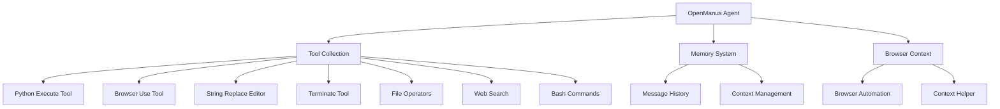

# OpenManus Documentation

## Overview
OpenManus is an open-source framework for building general AI agents that can perform various tasks using multiple tools. It's designed to be a versatile, general-purpose agent that can solve complex tasks without requiring an invite code.

## Architecture



## Core Components

### 1. Manus Agent (`app/agent/manus.py`)
The core agent class that orchestrates all operations:
- Inherits from `ToolCallAgent`
- Manages tool collection, memory, and browser context
- Maximum of 20 steps per task
- Supports up to 10,000 characters of observation

Key attributes:
```python
name: str = "Manus"
description: str = "A versatile agent that can solve various tasks using multiple tools"
max_observe: int = 10000  # Maximum characters to observe
max_steps: int = 20      # Maximum steps per task
```

### 2. Tool Collection

#### Python Execute Tool (`app/tool/python_execute.py`)
A safe way to execute Python code:
- Runs code in isolated process
- Implements timeout mechanism
- Captures print outputs
- Manages safe globals environment

Features:
- Process isolation
- Timeout handling
- Output capture
- Safe globals management

#### Browser Use Tool (`app/tool/browser_use_tool.py`)
Comprehensive web automation capabilities:
- Navigation controls
- Element interaction
- Content extraction
- Tab management
- State persistence

Available actions:
- `go_to_url`: Navigate to specific URLs
- `click_element`: Click on page elements
- `input_text`: Enter text into forms
- `scroll_down/up`: Page scrolling
- `scroll_to_text`: Find and scroll to text
- `send_keys`: Keyboard input
- `get_dropdown_options`: Get dropdown choices
- `select_dropdown_option`: Select from dropdowns
- `go_back`: Navigate back
- `web_search`: Perform web searches
- `wait`: Pause execution
- `extract_content`: Extract page content
- `switch_tab`: Change browser tabs
- `open_tab`: Open new tabs
- `close_tab`: Close current tab

### 3. Memory System
- Stores conversation history
- Manages context between steps
- Limits to last 3 messages for context

### 4. Browser Context
- Manages browser automation
- Handles web page interactions
- Maintains browser state
- Supports various web actions

## Safety Features

### 1. Resource Management
- Automatic cleanup of browser resources
- Memory limits
- Step limits
- Timeout mechanisms

### 2. Tool Safety
- Tool validation
- Execution boundaries
- Error handling
- Process isolation

### 3. Configuration Security
- API key management
- Environment isolation
- Safe defaults

## Key Features

### 1. Asynchronous Operation
- Built on Python's asyncio
- Non-blocking operations
- Efficient resource management

### 2. Tool Integration
- Modular tool system
- Easy to extend with new tools
- Tool validation and safety checks

### 3. Browser Automation
- Web page interaction
- Context-aware browsing
- Resource cleanup

### 4. Configuration Management
- TOML-based configuration
- Environment variable support
- Flexible API key management

## Usage Flow

1. Initialize the agent
2. Receive user prompt
3. Process through multiple steps:
   - Think about next action
   - Select appropriate tool
   - Execute tool
   - Update memory
   - Repeat until task completion
4. Clean up resources

## File Structure

```
OpenManus/
├── app/                    # Main application code
│   ├── agent/             # Agent implementation
│   │   ├── manus.py       # Core Manus agent
│   │   ├── browser.py     # Browser automation
│   │   └── toolcall.py    # Tool calling logic
│   ├── tool/              # Tool implementations
│   │   ├── base.py        # Base tool class
│   │   ├── browser_use_tool.py
│   │   ├── python_execute.py
│   │   ├── str_replace_editor.py
│   │   └── ...
│   ├── prompt/            # System prompts
│   └── logger.py          # Logging utilities
├── config/                # Configuration files
├── examples/              # Example usage
├── tests/                 # Test suite
├── main.py               # Entry point
├── run_flow.py           # Multi-agent flow
├── run_mcp.py            # MCP tool version
└── requirements.txt      # Dependencies
```

## Tool Implementation Details

### Python Execute Tool
```python
class PythonExecute(BaseTool):
    name: str = "python_execute"
    description: str = "Executes Python code string..."

    async def execute(self, code: str, timeout: int = 5) -> Dict:
        # Creates separate process
        # Implements timeout
        # Manages safe globals
        # Handles cleanup
```

### Browser Use Tool
```python
class BrowserUseTool(BaseTool, Generic[Context]):
    name: str = "browser_use"
    description: str = _BROWSER_DESCRIPTION

    async def execute(self, action: str, **kwargs) -> ToolResult:
        # Handles all browser actions
        # Manages browser state
        # Provides web interaction
```

## Getting Started

1. Install dependencies:
```bash
pip install -r requirements.txt
```

2. Configure the agent:
```bash
cp config/config.example.toml config/config.toml
# Edit config.toml with your settings
```

3. Run the agent:
```bash
python main.py
```

## Contributing

We welcome contributions! Please:
1. Fork the repository
2. Create a feature branch
3. Make your changes
4. Submit a pull request

## License

This project is licensed under the MIT License - see the LICENSE file for details.
